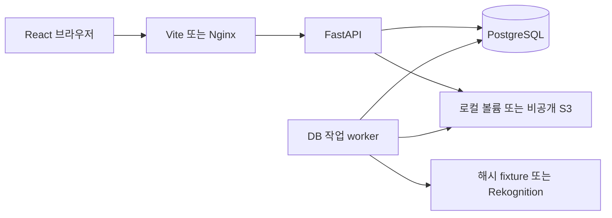

# 구현 구조

## 실행 경계

브라우저의 React·TypeScript·TanStack Query 앱은 `/api`만 호출한다. 개발 중 Vite가 FastAPI로 프록시하고, Compose에서는 Nginx가 정적 파일과 API 프록시를 담당한다. FastAPI와 별도 worker가 같은 PostgreSQL·파일 저장소를 사용한다. GitHub 저장소와 Pages 체험판은 공개되어 있다. Pages는 별도 브라우저 저장 모드이며 이 서버 구성의 AWS 배포는 아직 실행하지 않았다. 팀별 경계와 조립 방법은 [해커톤 작업 기반](hackathon/README.md)에 정리했다.

| 코드 | 역할 |
|---|---|
| `backend/app/main.py` | 9개 라우터 등록, 공통 HTTP 미들웨어·오류 처리 |
| `backend/app/routers/` | 인증·앨범·인물·사진·분석·버전·협업·그룹·상태 API |
| `dependencies.py`, `photo_operations.py`, `media.py`, `services.py` | 공통 인증, 업로드·재시도·파일 처리, 잠금·승인·직렬화 정책 |
| `models.py`, `backend/alembic/` | 관계·제약·영속 상태, 스키마 마이그레이션 |
| `analysis.py`, `worker.py` | 명시적인 분석 제공자, DB lease·재시도·실행 기록 |
| `grouping.py` | 앨범별 Rekognition 컬렉션, 전체 얼굴 검색, 그룹 연결 동기화 |
| `image_service.py`, `storage.py` | 검증·EXIF·렌더링·유사 사진 지표, 로컬/S3 어댑터 |
| `frontend/src/App.tsx`, `features/` | 앱 통합, 로그인·앨범·갤러리·상세·추천·그룹·보드 화면 |
| `frontend/src/Editor.tsx` | 보정 비교·확인 요청·최종본 화면 |

API 형식은 [API_CONTRACT.md](API_CONTRACT.md)에 정리한다. 원본·계정·앨범·버전·승인·분석 작업은 새로고침 이후에도 DB와 저장소에 남는다.

## 인증과 권한

비밀번호는 Argon2로 해시한다. 브라우저에는 HttpOnly·SameSite=Lax 세션 쿠키를 주고, DB에는 토큰의 SHA-256 값과 만료 시각을 저장한다. 쓰기 요청은 서버 세션에 연결된 `X-CSRF-Token`과 허용 Origin을 검사한다. HTTPS 환경은 `COOKIE_SECURE=true`를 사용한다.

모든 보호된 사진·인물·버전·다운로드·그룹 API는 앨범 멤버십을 확인한다. 작성자와 승인자는 세션에서 결정한다. 다른 계정의 인물 연결은 소유자의 제안 후 당사자 수락으로 확정한다. 데모 계정도 일반 로그인 절차를 사용한다.

## 업로드와 분석

1. JPEG·PNG의 실제 디코딩·MIME·파일 크기·픽셀 수를 검증한다. 원본 바이트와 해시는 그대로 보존한다.
2. 원본·썸네일·표시용 파일을 쓰기 전에 1시간 후 실행 가능한 `FileCleanup` 의도를 별도 트랜잭션으로 기록한다.
3. 파일 저장 후 `Photo`와 고유 `AnalysisJob`을 저장하면서 정리 의도를 제거한다. 중단된 업로드의 파일은 남은 의도로 회수한다.
4. `(album_id, uploader_id, request_id)` 고유 제약이 네트워크 재전송의 중복 등록을 막는다. 새 요청 ID는 의도적인 재업로드다.
5. worker가 DB의 처리 가능한 작업을 compare-and-swap으로 선점한다. API 요청은 분석 완료를 기다리지 않는다.

작업 상태는 `pending → processing → completed / failed`다. worker는 토큰과 heartbeat를 유지하며 만료된 lease를 회수한다. 완료 저장 시 토큰을 다시 확인하므로 이전 worker가 나중에 돌아와도 새 결과를 덮지 못한다. 일시적인 외부 오류는 지수 지연 후 설정 횟수까지만 재시도하고, 알 수 없는 fixture는 즉시 실패한다. 실행마다 `AnalysisRun`에 제공자·모드·시간·호출 수·오류를 기록한다.

`WORKER_CONCURRENCY`는 worker 프로세스당 동시 작업 수다. worker 인스턴스를 늘리면 전체 동시성도 증가하므로 AWS 호출 할당량에 맞춰 합계를 관리한다. 별도 worker가 멈추면 API만으로 분석이 진행되지는 않는다.

## 인물 판정과 수정

기준 사진 매칭은 앨범 내부의 등록 인물만 비교한다. 얼굴 좌표는 EXIF 방향을 정규화한 이미지 기준의 0~1 상대 좌표다. 원본 EXIF 좌표와 혼용하지 않는다. 얼굴 없음, 등록 인물과 불일치, 분석 실패는 구분한다.

`PhotoPerson`에는 자동 연결·그룹 연결·수동 추가·수동 제외가 남는다. 재분석은 수동 추가와 제외를 덮지 않는다. 그룹 분리·병합·인물 재연결은 `source=group` 연결만 다시 계산하고 영향받은 합의를 재검토 상태로 바꾼다. 그룹은 가입 계정 또는 승인과 별도 개념이다.

등록 없는 묶기는 실제 Rekognition 모드에서만 요청할 수 있다. 앨범 ID의 해시를 포함한 컬렉션을 사용하고 `IndexFaces`의 모든 얼굴에 각각 `SearchFaces`를 수행한다. 같은 사진의 여러 얼굴을 한 그룹으로 자동 합치지 않고, 애매한 후보는 별도 그룹으로 남긴다. 기존 얼굴 배치는 재실행으로 바꾸지 않아 사용자의 분리·병합을 보존한다.

## 렌더링과 합의

모든 보정은 업로드 원본을 EXIF 방향 정규화·sRGB 변환한 뒤 **밝기 → 채도 → 필요한 경우 축소** 순서로 적용한다. 밝기 기본값 1, 범위 0.25~2; 채도 기본값 1, 범위 0~2다. `pillow-v1`과 전체 설정값을 버전에 저장하며 이전 JPEG에 보정을 누적하지 않는다. 미리보기와 내보내기는 같은 렌더러를 사용한다. JPEG 결과에는 인코딩 손실이 있다.

렌더 캐시 키는 원본 해시·밝기·채도·렌더러 버전·출력 형식·출력 크기로 구분한다. 원본 다운로드는 업로드 바이트, 보정본 다운로드는 해당 버전을 원본 해상도로 렌더링한 결과다. S3 객체는 비공개이며 서버 권한 검사 후 기본 120초 서명 URL을 발급한다.

확인 요청 시 사람이 확인한 등장 인물과 연결 계정을 버전별로 저장한다. 미연결 인물이 있으면 요청을 막고, 얼굴 없는 사진은 업로더를 검토자로 명시한다. 새 버전은 승인 0개로 시작한다. 대상 전원 승인한 버전만 최종본으로 선택할 수 있고, 승인 취소·인물 변경·계정 연결 변경으로 조건을 잃으면 최종본을 해제한다. 해당 변경은 사진 행 잠금과 고유 제약으로 직렬화한다.

## 메타데이터·추천·운영 제한

촬영 시각과 서버 저장 시각은 별도다. EXIF 시간대가 없으면 시간대를 추측하지 않는다. GPS가 없으면 구체적인 장소명을 만들지 않는다. `GEOCODING_URL`이 설정된 경우에만 Nominatim 호환 역지오코딩을 호출하고, 실패해도 좌표를 보존한다.

유사 사진은 dHash 거리와 촬영 간격을 함께 보고 complete-link 방식으로 묶는다. 촬영 시각이 없으면 원본 해시가 같은 사진만 묶는다. 동일 전처리의 흔들림·노출 지표와 제공될 때의 눈 감음 정보를 그룹 안에서 비교한다. 얼굴 매칭 점수·웃음은 아름다움 점수가 아니다.

파일·컬렉션 삭제는 DB outbox에 기록하며 API와 worker가 재시도한다. worker는 약 30초마다 정리를 시도한다. 분석 중 AWS 인덱싱 응답을 받기 전에 프로세스가 죽는 경우처럼 외부 서비스와 DB를 원자적으로 커밋할 수 없는 경계는 남는다. 앨범 삭제 시 컬렉션 전체 정리 경로가 있으며, 장기 운영 전 원격 컬렉션 잔여 항목 점검이 필요하다.

알림은 저장 성공 후 별도 DB 트랜잭션으로 생성한다. 알림 실패가 저장을 취소하지 않으며, 현재 알림은 앱 내부 알림이다. 이메일·푸시 전송이나 외부 알림 스케줄러는 구현되어 있지 않다.

담당별 실제 코드 경로와 의존 방향은 [모듈 지도](hackathon/MODULES.md)를 따른다.
