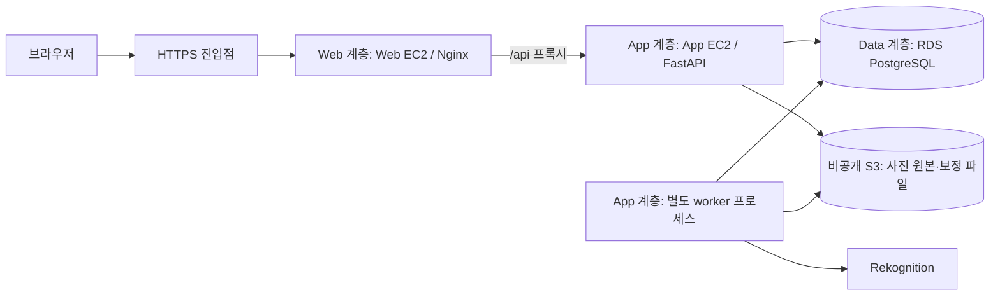

# 찍 3-Tier 배포·장애 복구 리허설

사용자가 제공한 「한 덩어리를 쪼갠다 · KIRO 클라우드 핸즈온 60분」(SLIDES.pdf, 30쪽)의 교육 취지를 반영한다. 교육 자료는 대회 규정이나 자원 생성 승인이 아니다. **3-Tier를 찍의 설계·검증·발표 핵심으로 준비**하되 실제 대회 환경은 별도로 확인한다. 현재는 절차 준비이며 AWS 분리 배포와 아래 장애 시연은 미실행이다.

## 목표 구성

Web/App은 별도 실행 환경, DB는 별도 RDS에 배치하는 목표다. worker는 App 계층이며 네 번째 Tier로 세지 않는다. S3는 사진 객체 저장소, Rekognition은 외부 분석 서비스다. HTTPS 진입 방식은 계정의 허용 서비스·도메인·인증서 조건 확인 후 확정한다. 미승인 ALB/CloudFront 등의 생성을 전제하지 않는다.

교육의 S3 정적 화면 → EC2 API → RDS도 같은 분리 원리다(20~24쪽). 찍은 팀 원문과 현재 코드에 맞춰 Web EC2/Nginx 방식을 유지한다. 현재 `/api` 상대 경로·세션 쿠키·사진 경로를 그대로 사용한다. S3에 프론트 빌드만 올려도 연결되는 구조가 아니다. 교육의 MariaDB/MySQL 연결 정보는 PostgreSQL에 대입하지 않는다.

## 서로 다른 두 리허설

| 리허설 | 확인할 것 | 현재 상태 |
|---|---|---|
| 코드 조립 | Kiro에서 각자 자기 프롬프트로 구현 → 실제 PR → 계약·기능 통합 검사 | 조립판 제공, 기계적 복원 검사 통과. 팀원 독립 구현 미검증 |
| 3-Tier 배포·복구 | 서로 다른 Web/App/RDS 연결, S3 저장, App 장애 범위와 복구 | 계획만 준비. AWS 실환경 미검증 |

한 컴퓨터의 Compose는 계층 간 연결을 연습할 수 있지만 AWS의 물리적 장애 격리 증거는 아니다. API/worker 재시작 후 데이터가 남는 기존 검사도 **중단 중 화면·오류 표시를 확인한 증거는 아니다**. API 한 대인 구성에 무중단이나 고가용성을 주장하지 않는다(교육 26·29쪽).

## 담당과 인계

- **1번 인프라:** 실제 배치·접근 경로·SG·HTTPS·허용 자원 확인, 중단/복구 운영, 실행 증거 취합.
- **2번 프론트:** App 중단 중 새로고침해도 정적 자산이 로드되는지, 통신 실패·재시도 안내가 보이는지 확인. 데이터가 필요한 화면 전체가 정상이라고 표현하지 않는다. 오류 화면에 부족함이 있으면 별도 기능 PR로 보완한다.
- **3번 백엔드:** DB 마이그레이션·세션·업로드·원본/보정본·승인/최종본 보존, 복구 후 신규 요청과 worker 연결 검증.
- **4번 AI:** 분석 중 중단된 작업의 lease·재시도·실패 상태·수동 수정 보존 확인. 실사진 정확도 검증은 별도 수행.
- **5번 보정:** 원본/보정 파일 해시·저장 설정·전원 승인·최종본이 복구 후 동일한지 확인.

## 실행 전 조건

1. 실제 계정·리전·소유 자원·IAM 권한·허용 서비스·비용 한도·유지 시간 확정. 현재 지시는 **새 자원 생성 없이 준비까지**다.
2. Web/App/RDS를 분리 배치할 수 있는지, PostgreSQL과 HTTPS 사용이 가능한지 확인. 불가능하면 운영진 조건을 확인하고 설계 변경을 별도 기록한다.
3. 동일 배포 커밋, 앱/worker 환경, DB migration, 비공개 S3 prefix를 기록한다. 인증 정보와 사용자 사진은 공개 증거에 넣지 않는다.
4. 시연 전용 환경과 테스트 앨범을 사용하고 DB·사진 백업 및 복구 경로를 확인한다. 공유 운영 서버나 강사·다른 팀 자원을 중단하지 않는다.

## 정상 → 중단 → 복구 시나리오

| 단계 | 실행·관찰 | 통과 기준 |
|---|---|---|
| 정상 | 서로 다른 기기에서 두 계정으로 로그인·앨범 참여·업로드·분석·보정·전원 승인·다운로드 | Web→App→RDS 연결, 사진 S3 저장, worker 처리까지 성공. 배포 커밋과 시각 기록 |
| 중단 전 기록 | 시연 앨범/사진/버전 ID, 원본·보정본 해시, 승인/최종본, 작업 상태 기록 | 복구 후 비교 기준 확보. 비밀값 없이 보관 |
| App 중단 | 대상 App의 API와 worker **프로세스만** 중단. Web/RDS/S3는 유지 | 중단 대상과 시각 기록. EC2 종료·볼륨 삭제·DB 삭제를 실행하지 않음 |
| 화면 확인 | 캐시만 보지 않도록 새로고침/새 브라우저 세션에서 HTML·JS·CSS 요청 확인 | Web이 응답하고 통신 오류·재시도 안내 표시. API 요청 실패를 성공이나 빈 앨범으로 오인시키지 않음 |
| 데이터 확인 | 허용된 별도 관리 경로로 RDS 기록·S3 객체 존재 확인 | API를 경유하지 않고 저장 데이터 보존 확인. 검증용 조회 경로는 계정 조건에 맞게 준비 |
| 복구 | 동일 커밋/환경으로 API·worker 기동, readiness 확인 후 기능 재검사 | 세션 유효기간 내 기존 세션·앨범·파일 해시·설정·승인·최종본 유지. 신규 업로드와 분석도 성공 |
| 작업 복구 | 별도 단계에서 분석 중인 worker만 중단 후 재기동 | lease/재시도 후 완료 또는 명시적 실패. 무한 처리 중 상태나 중복 반영 없음 |
| 종료 | 실행 시각·결과·실패 사항 기록, 시연용 데이터 정리 | 기록된 범위만 정리. 자원 종료/삭제는 별도 승인 범위 준수 |

프로세스 종료, EC2 중지, EC2 종료(terminate), 저장소 손실은 서로 다르다. 이 시연은 App 프로세스 장애를 대상으로 한다. 데이터 손실 후 백업 복원은 [백업·복원](BACKUP_RESTORE.md)의 별도 검증이며, RDS/S3 실복원은 아직 미검증이다.

## 발표와 완료 증거

1. 실제 배치와 일치하는 구조도로 Web/App/Data 및 사진 저장 위치 설명.
2. 두 계정의 정상 사용 → App 중단 → 정적 화면과 오류 안내 → RDS/S3 보존 → 복구 후 같은 데이터와 신규 작업 시연.
3. 장애가 다른 계층의 삭제로 번지지 않는다는 점과, API 중단 중 서비스 기능 일부는 사용할 수 없다는 한계를 함께 설명.

다음 표를 실행 후 작성한다. 준비만으로 체크하지 않는다.

| 증거 | 결과 | 기록 위치 |
|---|---|---|
| 배포 커밋·계층별 자원·마이그레이션·실행 환경 | 미검증 | 실행 후 기입 |
| 원격 두 계정 정상 흐름 | 미검증 | 실행 후 기입 |
| App 중단 중 Web 응답·오류/재시도 표시 | 미검증 | 실행 후 기입 |
| 중단 중 RDS/S3 데이터 조회 | 미검증 | 실행 후 기입 |
| 복구 후 파일 해시·세션·승인·신규 작업 | 미검증 | 실행 후 기입 |
| 분석 중 worker 장애 복구 | 미검증 | 실행 후 기입 |

대회 규정, 제공 환경, 사전 코드 허용 범위, 팀원 계정과 담당은 별도 확정 사항이다. 자료 속 배포 프롬프트는 교육 예시이며 이 문서 작성 과정에서 실행하지 않았다.
