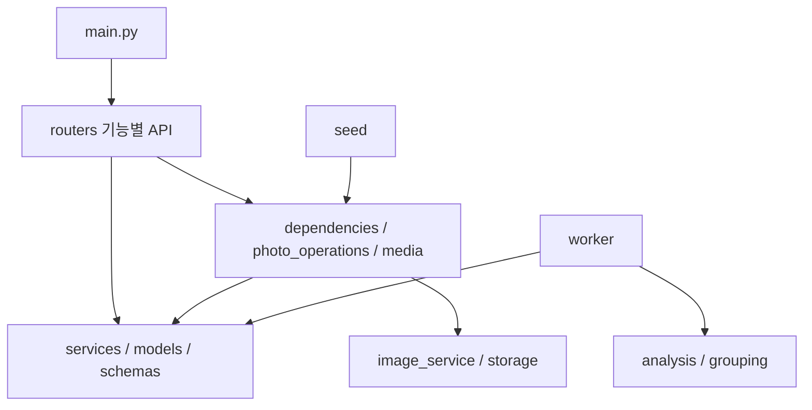

# 기능별 코드 지도

`main.py`는 HTTP 정책과 라우터 등록, `App.tsx`는 세션·현재 앨범·화면 전환과 공통 레이아웃을 맡는다. 각 담당은 아래 기능 파일에서 구현하고 통합 진입점은 필요한 경우만 수정한다.

## 서버

| 파일 (`backend/app/` 기준) | 책임 | 주관/통합 |
| --- | --- | --- |
| routers/system.py | 헬스 체크·런타임 설정 | 1/3 |
| routers/auth.py | 가입·로그인·세션·로그아웃 | 3 |
| routers/albums.py | 앨범·초대·설정·멤버·삭제 | 3 |
| routers/people.py | 기준 인물·계정 연결·수락·기준 사진 | 3, AI 검사 4 |
| routers/photos.py | 업로드·필터·상세·수동 수정·다운로드 | 3 |
| routers/analysis.py | 분석 상태·실패 재시도·추천 | 4/3 |
| routers/groups.py | 얼굴 그룹 분석·연결·병합·분리 | 4/3 |
| routers/versions.py | 보정·버전·승인·최종본 | 5/3 |
| routers/collaboration.py | 댓글·보드·알림 | 5/3 |
| dependencies.py | 세션 인증·연결 대상 멤버 확인 | 3 |
| photo_operations.py | 업로드 staging·파일 정리·분석 재요청 | 3 |
| media.py | 원본 응답·보정 버전 렌더 캐시·파일 응답 | 5/3 |

라우터는 다른 라우터나 `main.py`를 import하지 않는다. 공통 처리는 아래 계층을 사용한다. seed도 `photo_operations.upload_photo`를 사용하므로 전체 HTTP 앱을 불러오지 않는다.

API 경로·함수 이름·요청·오류·승인 정책·DB 스키마는 분리 전과 동일하다. 요청 처리의 커밋/잠금 순서도 보존한다. 테스트의 저장소 대체는 `storage.get_storage`, 잠금 관측은 해당 라우터의 함수를 대상으로 한다.

## 화면

| 파일 (`frontend/src/` 기준) | 책임 |
| --- | --- |
| features/auth/Login.tsx | 로그인·회원가입 |
| features/albums/AlbumHome.tsx | 앨범 목록 |
| features/albums/AlbumForms.tsx | 생성·참여·초대 |
| features/library/Library.tsx | 인물·검색·태그·선택·갤러리 |
| features/library/PhotoInfo.tsx | 사진 정보·메모·다운로드 |
| features/library/SearchField.tsx | 공통 사진 검색 입력 |
| features/curation/Recommendations.tsx | 유사 사진 추천 |
| features/curation/Groups.tsx | 얼굴 그룹 관리 |
| features/collaboration/Board.tsx | 선택·보정·확인·최종본 보드 |
| navigation.ts | 공통 화면 식별자 |

기존 Upload, People, Editor, AlbumSettings, AnalysisStatus와 공통 api/types/ui/styles는 유지한다. Library는 PhotoInfo·SearchField를 조합한다. 기능 컴포넌트에서 App을 import하지 않는다. 브라우저 체험의 ZIP 모듈은 새 위치에서 `../../demo/images`로 연결한다.

## 이번 단계의 경계

아직 독립 패키지나 빈 starter는 아니다. 공유 services/models와 이미지 전처리 경계, 응답 모델·타입 생성은 후속 작업이다. 기능 추가와 이 구조 이동은 별도 PR로 관리한다. 실제 AWS 검증 후 기준본을 확정하고 starter 재조립을 진행한다.
